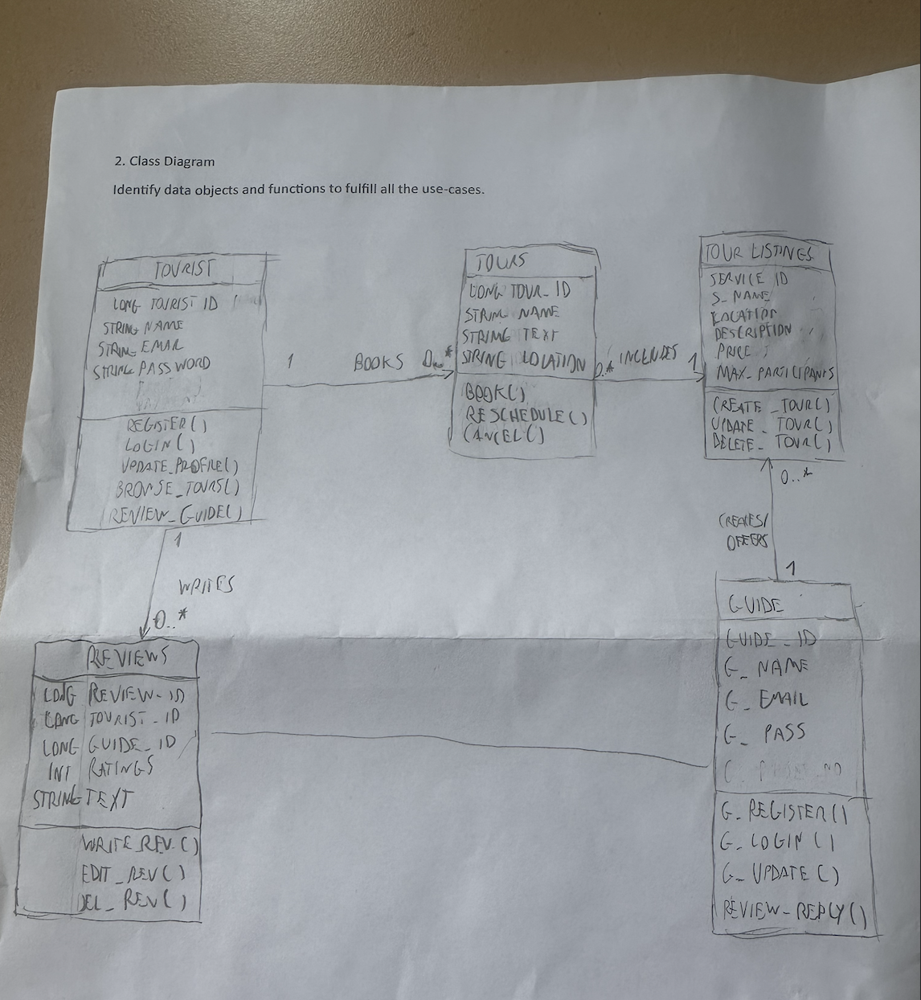

# LocalGuide Backend API


Actor: **Customer (Tourist)**, **Provider (Guide)**

Render URL: https://su26-team1.onrender.com/

---

## UML Class Diagram




---


## Use-Case → Endpoint Mapping

| Use Case | MVC Controller Method | Template |
|---|---|---|
| US-1: Create customer profile | `POST /customer/register` → `registerCustomer()` | `login.ftlh` |
| US-1: Login as customer | `POST /customer/login` → `loginCustomer()` | `login.ftlh` |
| US-1: View profile on dashboard | `GET /customer/dashboard` → `dashboard()` | `dashboard-customer.ftlh` |
| US-2: Browse tour locations | `GET /customer/locations` → `locations()` | `locations.ftlh` |
| US-3, US-9: Book a tour | `POST /customer/book` → `bookTour()` | `tour.ftlh` |
| US-3: Cancel a booking | `POST /customer/cancel/{tourId}` → `cancelTour()` | `dashboard-customer.ftlh` |
| US-6: Write a review | `POST /customer/review` → `submitReview()` | `review.ftlh` |
---


## API Endpoints

### 1. Tourist (Customer)

**Create customer profile**
```
POST /tourists
Body: { "name": "Jordan", "email": "jordan@email.com", "password": "pass123" }
```

**Login**
```
POST /tourists/login
Body: { "email": "jordan@email.com", "password": "pass123" }
```

**Modify customer profile**
```
PUT /tourists/{id}
Body: { "name": "Jordan P.", "email": "jordan@email.com", "password": "newpass" }
```

**Get all customers**
```
GET /tourists
```

**Get customer by ID**
```
GET /tourists/{id}
```

---


### 3. Tours (Bookings)

**Book a tour**
```
POST /tours
Body: { "touristId": 1, "serviceId": 2, "name": "Cave Booking", "text": "notes", "location": "Mendip" }
```

**Get all bookings for a tourist**
```
GET /tours/tourist/{touristId}
```

**Get single booking**
```
GET /tours/{id}
```

**Reschedule a booking**
```
PUT /tours/{id}
Body: { "name": "Cave Booking Updated", "text": "new notes", "location": "Mendip" }
```

**Cancel a booking**
```
DELETE /tours/{id}
```

---

### 4. Reviews

**Write a review**
```
POST /reviews
Body: { "touristId": 1, "guideId": 3, "rating": 5, "text": "Amazing tour!" }
```

**Get reviews by tourist**
```
GET /reviews/tourist/{touristId}
```

**Get reviews by guide**
```
GET /reviews/guide/{guideId}
```

**Get single review**
```
GET /reviews/{id}
```

**Edit a review**
```
PUT /reviews/{id}
Body: { "rating": 4, "text": "Updated review text" }
```

**Delete a review**
```
DELETE /reviews/{id}
```
---

### 5. Guide:
- GET /api/guides - returns a list of all guides.
- POST /api/guides - adds a new guide. Needs parameters name, email, password, and keyword.
- GET /api/guides/{id} - returns a specific guide by chosen id.
- PUT /api/guides/{id} - edits an already existing guide's parameters.
- DELETE /api/guides/{id} - deletes the specified guide.
- GET /api/guides/search?query={name} - returns guides that match the given name.
- GET /api/guides/keyword-search?keyword={keyword} - returns guides that match the given keyword. 

---


### 6. TourListings:
- GET /api/tour-listings - returns a list of all tour listings.
- POST /api/tour-listings - adds a new tour listing. Needs parameters name, location, description, price, and maxparticipants. Note that price is a double.
- GET /api/tour-listings/{id} - returns a specific tour listing by chosen id. 
- PUT /api/tour-listings/{id} - edits an already existing tour listing's parameters.
- DELETE /api/tour-listings/{id} - deletes the specified tour listing.
